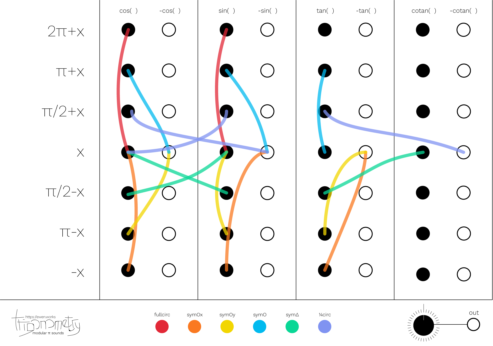

# Trigonometry Synth

:: fr-FR

(summary)
À la recherche de manières intéréssantes de représenter des identités trigonométriques, j’ai tenté de connecter les différentes formules de symmétrie de cos, sin, tan et cotan.

[post-reddit](https://www.reddit.com/r/synthesizers/comments/h8vd5d/so_i_was_trying_to_learn_trigonometry_symmetries/)

(reddit)
En réalisant l’image, je me suis rendu compte qu’elle s’apparentait à un synthétiseur, plus précisément un synthétiseur modulaire. J’ai aussi posté cette image sur [r/synthesizers](https://reddit.com/r/synthesizers) et ait reçu beaucoup de retours positifs et de possibles interprétations musicales d’une illustration.

(connect)
À la recherche de manières intéréssantes de représenter des identités trigonométriques, j’ai tenté de connecter les différentes formules de symmétrie de cos, sin, tan et cotan.

(change-of-interpretation)
En réalisant l’image, je me suis rendu compte qu’elle s’apparentait à un synthétiseur, plus précisément un synthétiseur modulaire. J’ai aussi posté cette image sur r/synthesizers et ait reçu beaucoup de retours positifs et de possibles interprétations musicales d’une illustration.

*[sin]: sinusoïdale

:: en-US

(summary)
Looking for interesting ways to represent trigonometric identities, I tried to connect the different symmetry formulas of cos, sin, tan and cotan.

*[sin]: sinusoïdal

[post-reddit](https://www.reddit.com/r/synthesizers/comments/h8vd5d/so_i_was_trying_to_learn_trigonometry_symmetries/)

(reddit)
While making the image, I realized that it was similar to a synthesizer, more precisely a modular synthesizer. I also posted this image on [r/synthesizers](https://reddit.com/r/synthesizers) and received a lot of positive feedback and possible musical interpretations of an illustration.

(connect)
Looking for interesting ways to represent trigonometric identities, I tried to connect the[^abcEF] different symmetry formulas of cos, sin, tan and cotan.

(change-of-interpretation)
While making the image, I realized that it was similar to a synthesizer, more precisely a modular synthesizer. I also posted this image on r/synthesizers and received a lot of positive feedback and possible musical interpretations of an illustration[^abcEF].

[^abcEF]: geogrje
